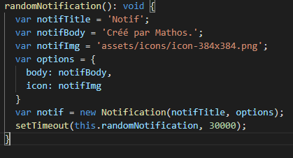

# Bienvenue sur le tutoriel magnifique PWA

Au cours de ce tutorat, vous serez amenés à développer une PWA à l'aide du service worker d'Angular (Youpi !).

## Prérequis

L'installation du CLI d'Angular :

```bash
npm install -g @angular/cli
```

## Création d'un projet Angular

Pour créer un projet sur Angular, on utilise la commande ci-dessous

```bash
ng new app --routing
```

Ensuite, on se rend dans le dossier de l'application, et on ajoute le service worker d'Angular :

```bash
ng add @angular/pwa --project app
```

Une modification doit-être faite dans le fichier **ngsw-config.json**


## Réalisation

Pour apprendre à se servir d'Angular, un tutoriel dédié est présent sur le site officiel :[Tutoriel Angular](https://angular.io/tutorial)

### Utilisation de l'API

De notre côté, nous allons seulement faire l'étape d'affichage de la liste, et ensuite nous allons utiliser l'API pour faire une page de connexion.

La première étape est de créer un service qui va contenir les fonctions d'appel à l'API, nous l'appelerons : AuthenticationService

```bash
ng g service authentication
```

Dans ce service , développez les fonctions pour faire une requête API en vous aidant de cette partie : [Request Data from a server](https://angular.io/tutorial/toh-pt6)

Ensuite, il faut créer un component d'authentification :

```bash
ng g component login
```

Ici, ajouter un formulaire et faites en sorte que lorsque que l'on valide celui-ci, on appelle les fonctions du services pour se connecter.

### Notification

Pour cette étape, nous souhaitons ajouter une notification lorsque la personne se connecte.

Aidez-vous des captures d'écran ci-dessous pour lancer une notificaton à ce moment.




### Accès à une ressource matérielle depuis le téléphone

Si l'on souhaite accèder à une ressource matérielle, il nous suffit d'utiliser un input de type file directement dans notre fichier html.

`<input type="file" accept="image/x-png,image/jpeg,image/gif"/>`
